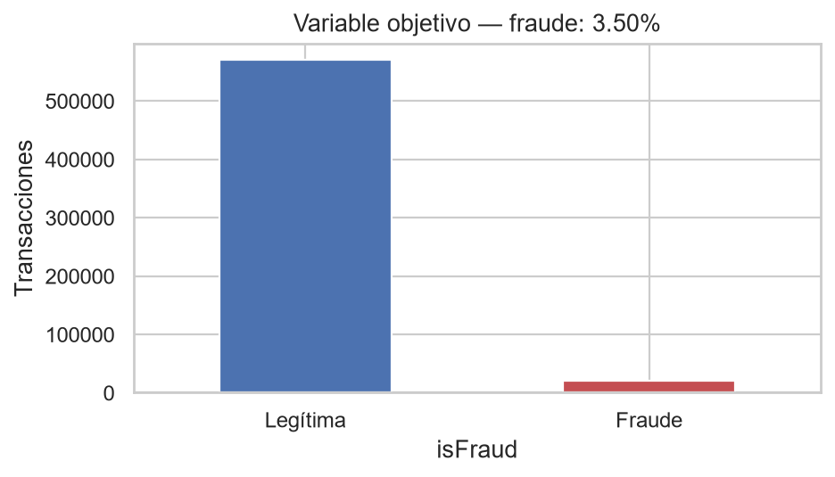
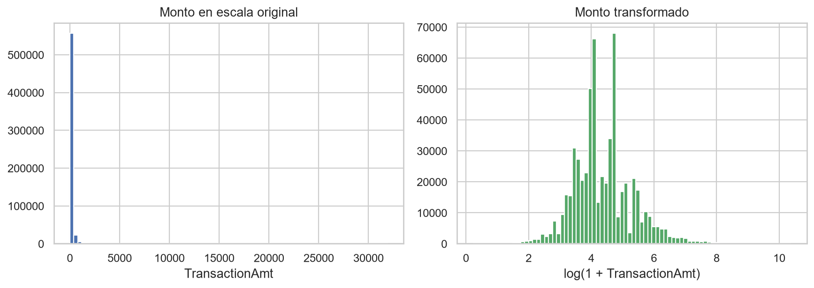
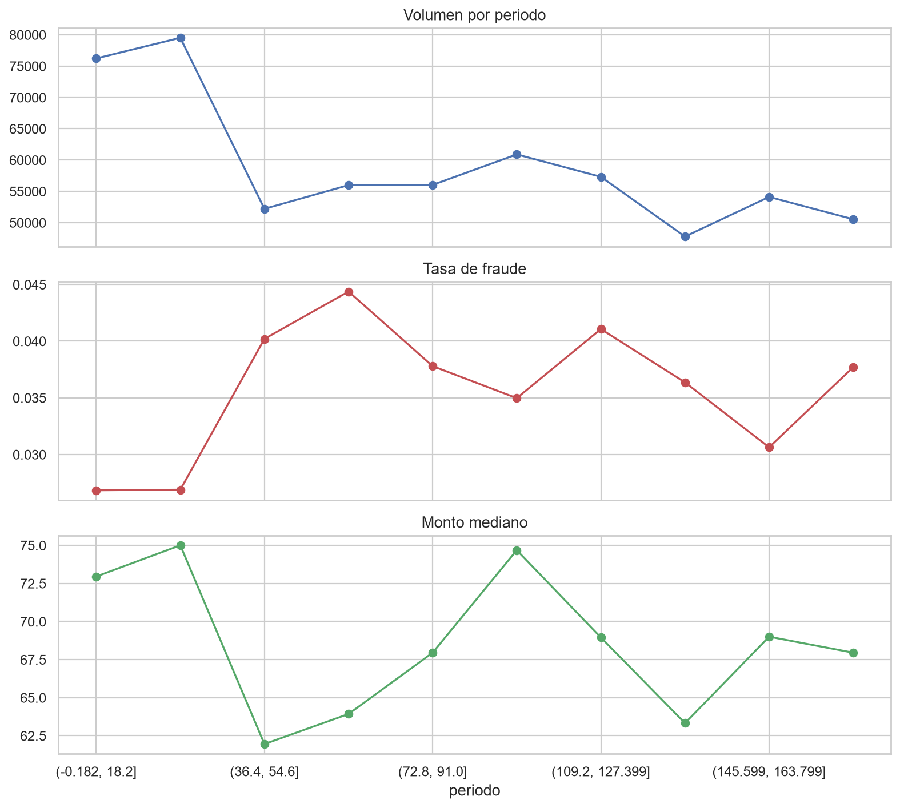

# Informe de exploración de datos

## 1. Propósito de la etapa

Esta etapa tuvo como objetivo conocer la estructura del conjunto IEEE-CIS Fraud Detection antes de definir transformaciones o entrenar modelos. Nos concentramos en los aspectos que afectan directamente la pregunta del proyecto: disponibilidad de la etiqueta, desbalance, distribución del monto, orden temporal, cobertura de la información de identidad y ausencia de datos.

El análisis reproducible se encuentra en [`notebooks/01_exploracion_datos.ipynb`](../notebooks/01_exploracion_datos.ipynb). Este documento sintetiza los resultados y las decisiones que se derivan de ellos; no reemplaza el notebook ni repite todo su código.

## 2. Datos utilizados

Trabajamos con los archivos etiquetados de la competencia:

- `train_transaction.csv`: 590.540 transacciones y 394 columnas.
- `train_identity.csv`: 144.233 registros y 41 columnas adicionales.

Realizamos un `left join` mediante `TransactionID`. La tabla resultante conserva las 590.540 transacciones y contiene 434 columnas. La cobertura de identidad es 24,42%, por lo que una unión interna eliminaría la mayoría de las observaciones etiquetadas y cambiaría la población analizada.

## 3. Resultados principales

### 3.1 Variable objetivo

Encontramos 20.663 transacciones fraudulentas, equivalentes al 3,499% del conjunto. Las 569.877 transacciones restantes son legítimas. Este desbalance hace que la exactitud sea insuficiente para evaluar el proyecto: una estrategia que aprobara todo acertaría la clase mayoritaria, pero no detectaría ningún fraude.



La evaluación predictiva deberá incluir AUC-PR y recall. Sin embargo, la comparación principal utilizará costo total y ahorro, porque el objetivo del proyecto es económico.

### 3.2 Monto de las transacciones

El monto mediano observado fue USD 68,50 en transacciones legítimas y USD 75,00 en fraudulentas. Los promedios fueron USD 134,51 y USD 149,24, respectivamente. La distancia entre promedio y mediana muestra que la distribución es asimétrica y contiene montos altos.



Las operaciones fraudulentas representan 3,87% del monto total, una proporción ligeramente superior a su participación por cantidad. Además, el 1% de los fraudes con mayor monto concentra 10,63% del monto fraudulento. Por lo tanto, reportaremos recall y costo de manera conjunta y revisaremos la sensibilidad a montos extremos sin eliminarlos automáticamente.

### 3.3 Comportamiento temporal

`TransactionDT` cubre aproximadamente 182 días y está ordenado de forma creciente. Al dividir el periodo en diez intervalos exploratorios, la tasa de fraude varió entre 2,68% y 4,44%. También se observaron cambios en el volumen de operaciones y en el monto mediano.



Estos resultados no demuestran por sí solos deriva de concepto, pero muestran que la prevalencia no permanece constante. Una partición aleatoria mezclaría periodos distintos y no representaría el escenario de entrenar con el pasado para decidir sobre transacciones futuras. En consecuencia, la evaluación principal será temporal.

### 3.4 Ausencia e información de identidad

De las 434 columnas unidas, 414 contienen al menos un valor ausente y 12 superan 90% de ausencia. La falta de información no tiene un único origen: parte ya existe en `train_transaction` y `train_identity`, y otra parte aparece porque la tabla de identidad solo cubre algunas operaciones.

La tasa de fraude fue 7,85% en transacciones con registro de identidad y 2,09% en aquellas sin identidad. A su vez, 54,77% de los fraudes tiene identidad, frente a 23,32% de las operaciones legítimas. Interpretamos este resultado como una asociación descriptiva, no como evidencia causal. Conservaremos un indicador de disponibilidad y evaluaremos su estabilidad temporal.

### 3.5 Variables categóricas

Algunas categorías presentan diferencias considerables. `ProductCD=C` registra 11,69% de fraude frente a 2,04% en `W`; las tarjetas de crédito presentan 6,68% frente a 2,43% en débito; y las operaciones con dispositivo móvil alcanzan 10,17%.

Estas cifras ayudan a comprender el conjunto, pero fueron calculadas con todos los datos y no se utilizarán directamente como codificaciones. Cualquier transformación basada en la etiqueta deberá aprenderse únicamente con el bloque de entrenamiento.

## 4. Decisiones derivadas del EDA

Con base en la evidencia anterior acordamos:

1. conservar el `left join` para mantener todas las transacciones etiquetadas;
2. no usar accuracy como criterio principal debido al desbalance;
3. conservar `TransactionAmt` en su escala original para la matriz de costos y declarar que representa una aproximación de la pérdida potencial;
4. construir train, validación y test en orden temporal;
5. ajustar imputación, eliminación de columnas y codificación después de separar los bloques;
6. diferenciar ausencia estructural de identidad y ausencia interna de las variables;
7. evaluar los montos extremos mediante sensibilidad, no eliminarlos únicamente por su magnitud.

## 5. Limitaciones de esta etapa

- `TransactionAmt` no es una pérdida bancaria neta confirmada: el dataset no informa recuperaciones ni contracargos.
- `TransactionDT` no tiene un origen calendario público; las horas y días derivados son relativos.
- Las asociaciones categóricas no implican causalidad.
- El EDA utiliza el conjunto etiquetado completo para descripción. Ninguna estadística global se reutilizará para ajustar transformaciones o seleccionar modelos.
- Esta etapa todavía no define imputadores, codificadores, atributos finales ni hiperparámetros.

## 6. Resultado de la etapa y continuación

La exploración confirma que el problema combina desbalance, ausencia extensa, cobertura parcial de identidad y variación temporal. También muestra por qué contar aciertos no es suficiente: el monto individual cambia la consecuencia económica de cada error.

La siguiente etapa será definir y congelar entrenamiento, validación, intervalos de separación y prueba. Esa división debe realizarse antes de construir transformaciones o atributos agregados.

## 7. Archivos reproducibles

Las evidencias seleccionadas se regeneran al ejecutar el notebook:

```text
results/
├── figures/
│   ├── eda_distribucion_objetivo.png
│   ├── eda_distribucion_montos.png
│   └── eda_evolucion_temporal.png
└── tables/
    ├── eda_cobertura_identidad_por_clase.csv
    ├── eda_distribucion_objetivo.csv
    ├── eda_fraude_segun_identidad.csv
    ├── eda_montos_por_clase.csv
    ├── eda_resumen_general.csv
    └── eda_resumen_temporal.csv
```
