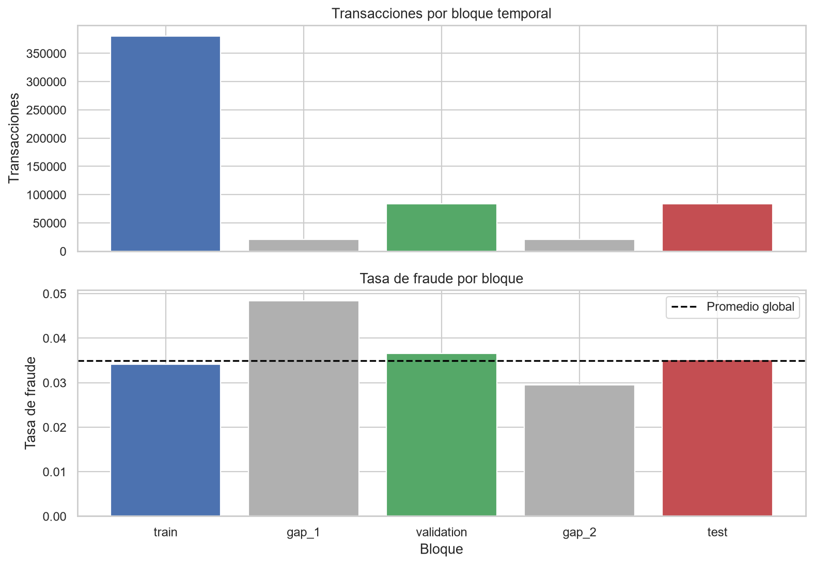

# Informe de partición temporal

## 1. Propósito de la etapa

En esta etapa definimos los bloques de entrenamiento, validación y prueba que se utilizarán durante el resto del proyecto. El objetivo fue construir una evaluación que represente el orden real de operación: aprender con transacciones pasadas, tomar decisiones metodológicas con un periodo posterior y reservar el periodo más reciente para la comparación final.

El procedimiento reproducible está en [`notebooks/02_particion_temporal.ipynb`](../notebooks/02_particion_temporal.ipynb). La asignación individual se guarda en `data/interim/split_manifest.parquet`, archivo derivado que no se versiona porque puede regenerarse desde los datos originales.

## 2. Justificación metodológica

Una partición aleatoria mezclaría transacciones de los 182 días disponibles en los tres bloques. Esto haría que entrenamiento y evaluación compartieran simultáneamente periodos iniciales y finales, ocultando los cambios de prevalencia observados en el EDA.

Dal Pozzolo et al. plantean la detección de fraude como un problema no estacionario en el que importan el orden de llegada y el retraso con que se conocen las etiquetas. Tomamos este principio como fundamento de la evaluación cronológica. La duración concreta de nuestros gaps no se atribuye al artículo: fue evaluada con los datos IEEE-CIS y responde al diseño de este proyecto. [Artículo de Dal Pozzolo et al.](https://doi.org/10.1109/TNNLS.2017.2736643).

## 3. Alternativas evaluadas

Fijamos dos límites sobre el rango temporal total:

- final de entrenamiento: 60% del periodo;
- final de validación: 80% del periodo.

Los gaps comienzan después de cada límite y consumen parte del intervalo siguiente. Comparamos separaciones de 1, 3 y 7 días.

| Gap | Train | Validación | Test | Fraudes validación | Fraudes test |
|---:|---:|---:|---:|---:|---:|
| 1 día | 380.815 | 102.118 | 101.693 | 3.980 | 3.471 |
| 3 días | 380.815 | 95.763 | 96.139 | 3.718 | 3.312 |
| 7 días | 380.815 | 84.093 | 84.233 | 3.075 | 2.960 |

Las tres configuraciones conservan suficientes fraudes. Elegimos 7 días porque representa un ciclo semanal completo en el tiempo relativo y es la alternativa más conservadora analizada. Esta decisión reduce la cercanía entre los límites sin dejar la calibración o la prueba dependientes de pocos positivos.

## 4. Partición seleccionada

La configuración definitiva es:

```text
train → gap de 7 días → validation → gap de 7 días → test
```



| Bloque | Transacciones | Fraudes | Tasa de fraude | Monto mediano |
|---|---:|---:|---:|---:|
| Train | 380.815 | 13.011 | 3,42% | USD 69,28 |
| Gap 1 | 20.995 | 1.015 | 4,83% | USD 67,79 |
| Validación | 84.093 | 3.075 | 3,66% | USD 67,95 |
| Gap 2 | 20.404 | 602 | 2,95% | USD 72,15 |
| Test | 84.233 | 2.960 | 3,51% | USD 68,50 |

Los gaps excluyen 41.399 transacciones y 1.617 fraudes del ajuste y de la evaluación. No interpretamos esto como un error ni ocultamos su costo: es la consecuencia de imponer separación temporal. Las observaciones permanecen identificadas en el manifiesto como `gap_1` y `gap_2`, pero no participarán en entrenamiento, selección, calibración o prueba.

La diferencia de prevalencia entre bloques confirma que una partición aleatoria habría producido conjuntos artificialmente parecidos. En particular, el primer gap contiene 4,83% de fraude, mientras que el segundo contiene 2,95%.

## 5. Categorías no observadas durante entrenamiento

Medimos valores que aparecen por primera vez en validación o test respecto a train:

| Variable | Validación | Test |
|---|---:|---:|
| Tarjeta compuesta | 1,49% | 2,16% |
| Dirección compuesta | 0,05% | 0,03% |
| Dominio de correo | 0,00% | 0,00% |

La tarjeta compuesta combina `card1`, `card2`, `card3` y `card5`; la dirección combina `addr1` y `addr2`. Estos valores son descripciones operativas, no identificaciones verificadas de una persona.

La presencia de tarjetas nuevas demuestra que los codificadores posteriores deben aceptar categorías desconocidas. No podemos construir un vocabulario con todo el dataset antes de separar, porque eso informaría al pipeline de valores que todavía no habían aparecido durante entrenamiento.

## 6. Comprobaciones realizadas

El notebook verifica automáticamente que:

1. las 590.540 transacciones reciben exactamente una etiqueta de bloque;
2. no existen `TransactionID` duplicados;
3. train, gaps, validación y test aparecen en orden temporal estricto;
4. validación y test contienen fraudes suficientes;
5. el manifiesto puede guardarse y leerse sin perder filas ni asignaciones.

Las funciones de partición se encuentran en `src/fraud_cost/split.py` y cuentan con pruebas unitarias en `tests/test_split.py`. Esto evita que notebooks posteriores implementen límites diferentes.

## 7. Uso permitido de cada bloque

- **Train:** ajuste de imputadores, codificadores, ingeniería de atributos y modelo base.
- **Validación:** selección de hiperparámetros, comparación de configuraciones y ajuste/selección del calibrador según el protocolo definido.
- **Test:** evaluación final de probabilidades y comparación económica de las tres estrategias.
- **Gaps:** no se utilizan para aprender ni evaluar; solo preservan la separación.

El test no podrá utilizarse repetidamente para corregir el modelo. Si una decisión se toma después de observar sus resultados, esa evaluación deja de ser independiente y deberá declararse.

## 8. Limitaciones y decisiones pendientes

- Los límites se expresan en tiempo relativo porque `TransactionDT` no tiene un origen calendario público.
- Un gap reduce proximidad, pero no garantiza que una tarjeta o dispositivo nunca reaparezca después. Esa reaparición puede ser legítima en un escenario real.
- La semana de separación es una decisión conservadora del proyecto, no un valor universal.
- La estrategia exacta para atributos históricos todavía debe definirse. Ningún agregado podrá utilizar observaciones futuras respecto a la transacción que representa.
- El calibrador deberá ajustarse sin acceder al test; el notebook de modelado documentará si se emplea validación completa o una subdivisión interna.

