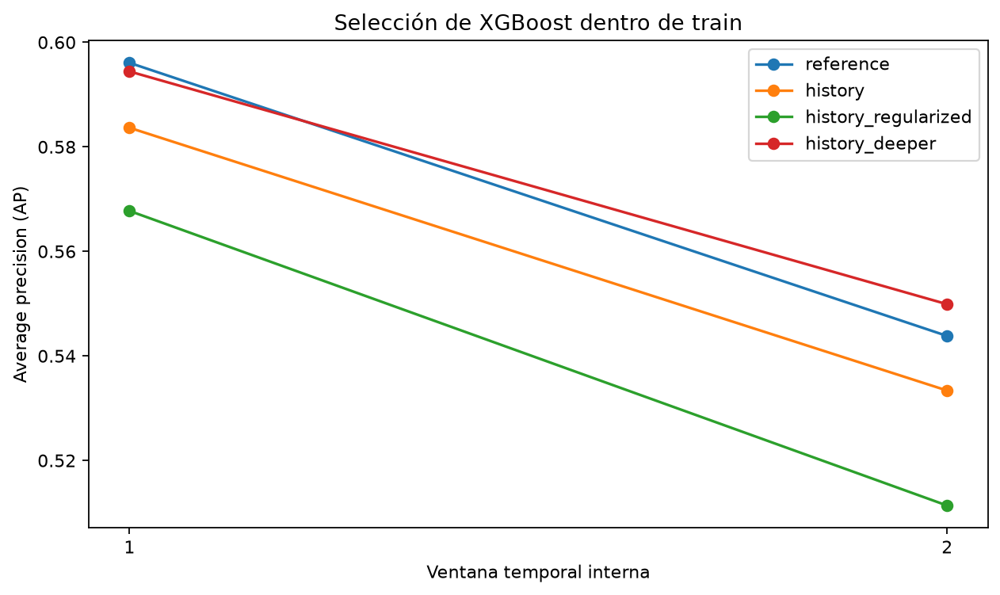

# Preparación de variables y selección temporal del predictor

## 1. Pregunta de esta etapa

Después de construir la línea base, nos preguntamos si una representación que incorpore el historial disponible de cada operación permite ordenar mejor los fraudes y qué configuración de XGBoost resulta más consistente entre periodos. Esta pregunta antecede a la comparación económica: una mejor AP no demuestra por sí sola mejor calibración ni mayor ahorro.

El experimento está en `notebooks/05_preparacion_y_seleccion_temporal.ipynb`. Las funciones de atributos y preparación están en `src/fraud_cost/features.py`; las ventanas, búsqueda y trazabilidad están en `src/fraud_cost/selection.py`. Este informe explica el diseño, sus resultados y las decisiones que se desprenden de ellos.

## 2. Población y protocolo temporal

Recuperamos únicamente las transacciones asignadas a train por el manifiesto existente, antes de unir identidad. La búsqueda no resume etiquetas ni produce predicciones sobre validación externa o test. El CSV original incluye todos los periodos y se lee por bloques; las filas ajenas a train se descartan antes de preparar variables o modelar.

Dentro de train fijamos dos ventanas expansivas. Los límites de entrenamiento corresponden al 60% y 80% de su duración temporal. Las evaluaciones se ubican en el intervalo siguiente, excluyendo siete días después de cada límite. La partición depende del tiempo, no del número de filas. Verificamos orden estricto, exclusión de IDs compartidos dentro de cada fold y presencia de ambas clases.

El entrenamiento del segundo fold incorpora periodos posteriores al primero, incluidos datos que ya fueron evaluación interna. Esto es normal en una ventana expansiva. Por esa dependencia y por el pequeño número de ventanas, no tratamos los resultados como réplicas independientes ni utilizamos su desviación como un intervalo de confianza.

## 3. Construcción de variables

La representación base conserva variables originales, señal de identidad y la preparación equivalente de categorías y ausencia. Excluimos identificador, etiqueta, bloque y marca temporal cruda de la entrada del clasificador. La referencia de esta etapa utiliza su propio ajuste por fold y matrices float32; no es una repetición de la corrida anterior de los notebooks 03 y 04.

La representación ampliada añade:

- `log1p(TransactionAmt)`, que conserva cero y comprime la escala de montos altos;
- conteo de campos ausentes de la representación de transacción, calculado antes de imputar;
- seno/coseno de las fases diaria y semanal relativas de TransactionDT;
- conteo de operaciones anteriores, monto promedio anterior y tiempo desde la última operación para tres agrupaciones.

TransactionDT no tiene un origen calendario público. Por eso estas fases no se nombran hora local o día real de la semana. El monto original permanece disponible en los datos fuente; su transformación predictiva no cambia el costo del falso negativo.

Las agrupaciones son una tarjeta compuesta (`card1`, `card2`, `card3`, `card5`), DeviceInfo y dominio del correo del comprador. Son proxies de agrupación: no identifican personas, tarjetas ni dispositivos físicos de forma verificada. Un dominio de correo puede reunir muchos usuarios y DeviceInfo puede representar información compartida entre equipos.

## 4. Historial estrictamente anterior

Para cada transacción de entrenamiento calculamos estadísticas con tiempo menor al suyo. Agrupamos las operaciones simultáneas como un lote y excluimos todo el lote del historial disponible. Así, el monto de una operación no se usa para construir el promedio anterior de otra operación simultánea.

En evaluación utilizamos el estado congelado de la ventana de entrenamiento. Las operaciones del gap o de la propia evaluación no actualizan los conteos ni promedios. Esta convención evita aprender incluso estadísticas no supervisadas de los periodos evaluados y es reproducible, aunque representa una operación con actualización de historial por lotes, no un servicio que actualiza después de cada transacción.

Una agrupación nueva o con componentes incompletos recibe conteo cero y estadísticas ausentes. El imputador aprende cómo tratar esas ausencias solo con el entrenamiento del fold. No construimos tasas de fraude por agrupación ni codificaciones que consulten etiquetas.

## 5. Preparación dentro de cada fold

Reajustamos medianas, indicadores y vocabulario en cada ventana de entrenamiento. La codificación one-hot tolera categorías desconocidas y agrupa categorías raras usando frecuencia mínima de 50, aprendida en esa ventana. Conservamos columnas completamente ausentes y su señal explícita de falta de información; no aplicamos una regla automática de eliminación por porcentaje de ausencia.

Representamos las matrices en float32 y usamos salida dispersa cuando corresponde. Es una decisión de memoria, no un método de balanceo ni selección por etiqueta. En el cargador convertimos variables flotantes a float32, exceptuando el monto original; IDs y tiempos se conservan en sus tipos enteros.

Las pruebas comprueban pasado estricto, empate temporal, conservación de índices, independencia de etiquetas, historial congelado, entidades nuevas, categorías desconocidas y exclusión de bloques externos. También recorren una búsqueda pequeña completa antes del experimento real.

## 6. Comparación predeclarada

| Candidato | Variables | Diferencia de configuración |
|---|---|---|
| reference | Base | 250 árboles, profundidad 6, min_child_weight 10 |
| history | Ampliadas | Misma configuración que reference |
| history_regularized | Ampliadas | Profundidad 4, min_child_weight 20, reg_lambda 5 |
| history_deeper | Ampliadas | Profundidad 8, min_child_weight 10, reg_lambda 5 |

Los demás parámetros se mantienen: learning_rate 0,05, subsample 0,8 y colsample_bytree 0,8. Limitamos a cuatro hilos y fijamos semilla 42. No aplicamos remuestreo ni early stopping sobre la ventana que después puntuamos. Reutilizamos el preprocesamiento entre candidatos del mismo esquema y fold, pero nunca entre folds.

reference frente a history es una comparación del conjunto de atributos con parámetros iguales; no atribuye el efecto a una variable histórica individual. Las otras configuraciones exploran profundidad y regularización de forma acotada. No es una búsqueda exhaustiva ni garantiza que no exista una alternativa mejor.

Seleccionamos por AP media con el mismo peso para cada periodo. En un empate exacto conservamos el orden predeclarado de candidatos. Brier y log-loss describen las probabilidades sin calibrar, pero no deciden la selección. No escogemos configuraciones con el costo de los escenarios ilustrativos ni ajustamos el umbral clasificatorio.

## 7. Resultados y evidencia

### 7.1. Ventanas evaluadas

La entrada contiene 380.815 transacciones de train. Las dos ventanas internas no usan toda esa población como evaluación: una parte forma el pasado de entrenamiento y otra queda excluida por los gaps.

| Fold | Filas de entrenamiento | Filas evaluadas | Fraudes evaluados | Fin de entrenamiento | Inicio de evaluación | Fin de evaluación |
|---|---:|---:|---:|---:|---:|---:|
| 1 | 242.198 | 44.024 | 1.677 | 5.747.276 | 6.352.100 | 7.634.011 |
| 2 | 307.224 | 46.113 | 1.703 | 7.634.011 | 8.239.468 | 9.521.218 |

Los límites están expresados en segundos de TransactionDT, no en fechas calendario. Ambas evaluaciones comienzan más de siete días después de la última operación de su entrenamiento.

### 7.2. Discriminación y elección

| Candidato | AP fold 1 | AP fold 2 | AP media | Brier medio, sin calibrar | Log-loss media, sin calibrar |
|---|---:|---:|---:|---:|---:|
| history_deeper | 0,5944 | 0,5499 | 0,5722 | 0,02263 | 0,09367 |
| reference | 0,5961 | 0,5438 | 0,5700 | 0,02273 | 0,09483 |
| history | 0,5837 | 0,5334 | 0,5585 | 0,02301 | 0,09573 |
| history_regularized | 0,5677 | 0,5114 | 0,5396 | 0,02363 | 0,09862 |

Seleccionamos **history_deeper**, con profundidad 8, min_child_weight 10 y reg_lambda 5, por la AP media predefinida. Su diferencia frente a reference es 0,00221 de AP, aproximadamente 0,22 puntos porcentuales: pequeña y no uniforme. Reference gana en el primer periodo por 0,00165; history_deeper gana en el segundo por 0,00607. No convertimos esa ventaja media en una afirmación de superioridad estadística o económica.

La comparación con parámetros iguales es especialmente útil: history queda por debajo de reference en ambos periodos, con pérdida media de 0,01143 de AP. Nuestra evidencia no respalda que añadir estos atributos, bajo profundidad 6 y la preparación utilizada, mejore automáticamente la discriminación. Tampoco permite afirmar que el historial sea inútil bajo cualquier configuración.

La elección ganadora combina atributos ampliados, mayor profundidad y una regularización distinta. No incluimos un candidato base con profundidad 8; por tanto, no aislamos si la ventaja procede del historial, de la capacidad del modelo o de su interacción. Si exploramos esa ablación después, deberá registrarse como un experimento posterior, no como parte predeclarada de esta grilla.

Todos los candidatos pierden AP en la segunda ventana. Observamos variación temporal del rendimiento, pero dos periodos no permiten atribuirla exclusivamente a deriva conceptual: también cambian la población, el pasado disponible y la dificultad de las operaciones. Brier y log-loss son diagnósticos de probabilidades sin calibrar, no pruebas suficientes de calibración adecuada para BMR.

### 7.3. Qué encontramos en las variables

La representación base tiene 432 columnas y la ampliada 447: añadimos 15 atributos. Después de preparar categorías e indicadores, las matrices base tienen 2.146 y 2.382 columnas en los folds 1 y 2; las ampliadas, 2.167 y 2.403. Esta diferencia entre folds es esperada porque vocabularios y agrupaciones de categorías raras se aprenden de cada pasado, no de todo el dataset. Todas las matrices son float32 y no encontramos columnas de entrada completamente ausentes en estos entrenamientos.

| Proxy | Evaluación sin historial, fold 1 | Evaluación sin historial, fold 2 |
|---|---:|---:|
| Tarjeta compuesta | 4,07% | 2,99% |
| DeviceInfo | 84,47% | 86,57% |
| Dominio del comprador | 13,95% | 17,17% |

El historial de DeviceInfo tiene cobertura limitada. La condición de conteo cero reúne claves incompletas y claves no observadas en entrenamiento; no identifica exclusivamente dispositivos nuevos. La tarjeta compuesta dispone de historial para una proporción mayor de operaciones, pero seguimos tratándola como proxy, no como identificación de una tarjeta física. La cobertura por sí sola tampoco demuestra utilidad predictiva: para eso necesitamos la comparación experimental y, si queremos atribución individual, otras ablaciones.

### 7.4. Evidencia reproducible

Las tablas exportadas son `seleccion_temporal_ventanas.csv`, `preparacion_diagnostico.csv`, `seleccion_temporal_folds.csv` y `seleccion_temporal_resumen.csv`, todas en `results/tables/`. La figura siguiente muestra el cambio de posición entre periodos.

`seleccion_temporal_config.json` registra la grilla, elección, versiones, estado Git y hashes de fuentes, manifiesto y CSV originales. La corrida utiliza NumPy 2.4.6, pandas 2.3.3, scikit-learn 1.9.1 y XGBoost 3.2.0. Los tiempos exportados corresponden al ajuste y predicción de cada candidato; no incluyen toda la carga y preparación y no son un benchmark universal.

El hash del notebook se calcula con tipos y fuentes de celdas, excluyendo salidas y conteos, para que ejecutar y guardar resultados no cambie la identidad del diseño. Los hashes de CSV y módulos se calculan sobre sus bytes. El commit se acompaña del estado de cambios locales: no se presenta un commit anterior como si contuviera las fuentes nuevas.

## 8. Alcance de la decisión y siguiente etapa

La etapa siguiente, implementada en el notebook 06 y explicada en `docs/06_reajuste_y_calibracion.md`, reajusta la configuración seleccionada con todo train. Ajusta un calibrador con puntuaciones tempranas de ese mismo predictor y diagnostica probabilidades y clasificación en validación posterior, dejando la comparación económica para después. No reutiliza el calibrador ni las probabilidades de la línea base anterior.

Las métricas internas de esta etapa no se comparan directamente con las métricas de validación externa publicadas en el informe 04: las poblaciones, ventanas y entorno son diferentes. El criterio económico sigue siendo costo/ahorro; AP es aquí el criterio de selección de un predictor antes de aplicar la matriz.

Dos folds y una grilla corta dejan incertidumbre temporal. El efecto conjunto de atributos no identifica su contribución individual; una ablación posterior deberá declararse como otro experimento. Además, no podemos auditar el proceso de construcción de todas las columnas anonimizadas originales de IEEE-CIS. Nuestras garantías de pasado estricto se refieren a los atributos nuevos y a las transformaciones que ajustamos.

La matriz con Ca, el corte 0,5 y las particiones externas se conservan. Test permanece sin puntuar. Esta selección produce una decisión de configuración reproducible, no una conclusión de ahorro ni un modelo final listo para producción.
