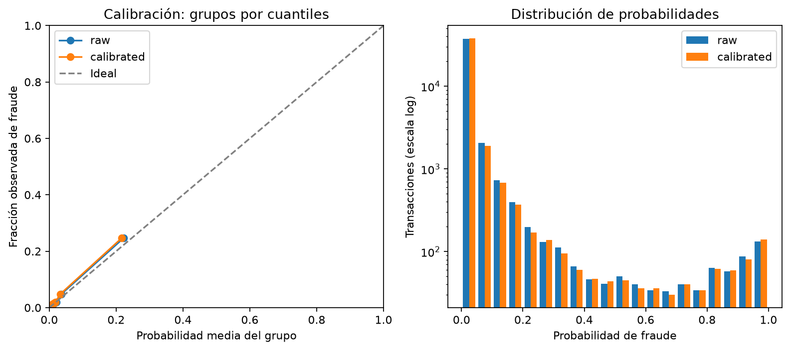

# Reajuste del predictor seleccionado y calibración temporal

## 1. Pregunta de esta etapa

En el notebook 05 elegimos history_deeper por AP media dentro de train. Su ventaja fue pequeña y cambió entre periodos; no la interpretamos como una garantía de mejor calibración o ahorro. Ahora nos preguntamos cómo se comporta ese predictor, reajustado con todo train, y qué cambia cuando calibramos sus probabilidades con un periodo posterior.

El experimento está en `notebooks/06_reajuste_y_calibracion.ipynb`. La implementación reutilizable está en `src/fraud_cost/refit.py` y utiliza los atributos de `features.py`. El propósito es dejar un predictor y un calibrador coherentes, junto con un diagnóstico reproducible. No optimizamos el umbral clasificatorio ni evaluamos todavía decisiones económicas.

## 2. Población y responsabilidades temporales

Antes de cargar desarrollo verificamos los hashes de datos, manifiesto y fuentes registrados en la selección del 05. Una configuración no debe reutilizarse como si estuviera respaldada por el mismo experimento cuando cambiaron sus entradas. El registro conserva el commit y el estado de cambios locales, además de hashes que identifican las fuentes efectivamente utilizadas.

El cargador recupera solo train y validation. El CSV original incluye otros periodos y se lee por bloques, pero sus filas se descartan antes de unir identidad, construir atributos o modelar. No producimos predicciones, costos ni resúmenes de etiquetas para test o gaps en esta etapa.

Train ajusta historial, imputación, codificación y XGBoost. Dividimos validation por orden temporal: aproximadamente la mitad temprana ajusta el calibrador y la posterior diagnostica el resultado. Si el límite por filas cae dentro de un instante con varias operaciones, conservamos todo ese lote en calibración para mantener orden estricto. Las fracciones de esta división son por filas, no por duración, a diferencia de las ventanas internas del 05.

Se conserva el gap externo de siete días. No añadimos otro gap entre las dos mitades de validation. Este protocolo no modela explícitamente el retraso con que una operación obtiene su etiqueta ni convierte periodos vecinos en muestras independientes. Validación posterior sigue siendo desarrollo, pues ya participó en diagnósticos y exploraciones de etapas anteriores.

## 3. Reajuste y conservación del historial

Utilizamos los hiperparámetros seleccionados: 250 árboles, profundidad 8, learning_rate 0,05, min_child_weight 10, reg_lambda 5, subsample 0,8 y colsample_bytree 0,8. Conservamos cuatro hilos, semilla 42 y frecuencia mínima de categorías 50. No hacemos otra búsqueda con validation ni utilizamos early stopping sobre el periodo que luego diagnosticamos.

Reajustar no significa incorporar validation al predictor: significa aprender de nuevo atributos, medianas, vocabulario y árboles con todo train. Los 447 atributos ampliados incluyen los originales utilizables y 15 atributos de la etapa 05; la matriz transformada depende del vocabulario aprendido con este pasado completo.

Para entrenamiento, cada historial utiliza únicamente tiempos anteriores al de la operación. Para ambas mitades de validation utilizamos el estado de train congelado. Las operaciones de calibración no actualizan el historial utilizado al diagnosticar la ventana posterior. Esto mantiene la convención que se comparó en la selección, aunque no simula un servicio con actualización en línea después de cada operación.

El monto original se conserva sin reducir precisión en las tablas de evaluación; convertir los atributos predictivos a float32 no modifica el monto que utilizará la matriz de costos.

## 4. Qué ajusta el calibrador

El predictor produce una probabilidad original `p`. La calibración que mantenemos desde la línea base estima:

```text
z = log(p_recortada / (1 - p_recortada))
p_calibrada = sigmoid(a × z + b)
sigmoid(u) = 1 / (1 + exp(-u))
```

Recortamos `p` a `[10⁻⁶, 1−10⁻⁶]` para evitar logits infinitos. Ajustamos una regresión logística con `C=10⁶`, solver lbfgs y máximo de 1.000 iteraciones sobre puntuaciones de validation temprana. C controla la regularización inversa; un valor grande representa una penalización débil, no una búsqueda de ese parámetro en la ventana posterior.

La pendiente `a` y el intercepto `b` corrigen la escala de riesgo. Cuando `a>0`, el mapeo conserva el orden salvo empates introducidos por recorte o precisión numérica. Por ello AP puede permanecer igual aunque Brier, log-loss y las decisiones al corte 0,5 cambien. Una pendiente positiva tampoco demuestra calibración adecuada: necesitamos observar el diagnóstico temporal posterior.

El calibrador pertenece a este predictor. Después de ajustarlo no volvemos a entrenar XGBoost ni sustituimos el preprocesamiento. Si cambia ese conjunto, deberá revisarse y reajustarse la calibración. No reutilizamos el calibrador del notebook 03.

## 5. Resultados de la corrida

### 5.1. Ventanas efectivamente utilizadas

| Bloque | Transacciones | Fraudes | Prevalencia | Tiempo inicial | Tiempo final |
|---|---:|---:|---:|---:|---:|
| Train | 380.815 | 13.011 | 3,4166% | 86.400 | 9.521.218 |
| Calibración temprana | 42.046 | 1.558 | 3,7055% | 10.126.067 | 11.293.017 |
| Diagnóstico posterior | 42.047 | 1.517 | 3,6079% | 11.293.020 | 12.666.174 |

TransactionDT se expresa en segundos relativos, no en fechas calendario. El gap observado entre train y calibración es superior a siete días. Las mitades de validation quedan separadas por tres segundos en sus observaciones límite; son periodos consecutivos sin un gap adicional. En esta corrida no fue necesario trasladar filas para mantener unido un lote simultáneo.

El reajuste produjo una matriz de 380.815 filas y 2.642 columnas float32 a partir de los 447 atributos ampliados. Las dimensiones son distintas de las ventanas internas porque el vocabulario se aprende ahora de todo train.

### 5.2. Qué cambió después de calibrar

| Diagnóstico posterior | Probabilidad original | Probabilidad calibrada |
|---|---:|---:|
| AP | 0,464794 | 0,464794 |
| Brier score | 0,02494245 | 0,02500318 |
| Log-loss | 0,10079061 | 0,10115569 |
| Probabilidad media | 3,3019% | 3,1323% |
| Prevalencia observada | 3,6079% | 3,6079% |
| Recall a 0,5 | 28,4773% | 27,8840% |
| Precision a 0,5 | 75,3927% | 75,1332% |
| Tasa de legítimas positivas a 0,5 | 0,3479% | 0,3454% |

La calibración **no mejora los dos diagnósticos probabilísticos globales en este periodo posterior**: Brier aumenta aproximadamente 0,0000607 y log-loss, 0,0003651. Son diferencias pequeñas; no calculamos aquí incertidumbre estadística ni las presentamos como prueba de inferioridad general del método. El resultado muestra que ajustar un calibrador no garantiza que la corrección se transfiera mejor a otro periodo.

El mapeo aprendido tiene pendiente `a=1,021799` e intercepto `b=−0,024710`. La pendiente positiva explica que AP permanezca igual: no cambiamos el orden de las operaciones. El cambio de escala reduce la probabilidad media posterior y amplía la subestimación global de la prevalencia, de aproximadamente 0,306 a 0,476 puntos porcentuales. Este desajuste no basta por sí solo para evaluar calibración local, pero es relevante antes de multiplicar `p_i` por el monto en BMR.

La clasificación conserva exactamente el corte 0,5. Sus cambios proceden de la escala probabilística, no de una optimización del umbral. Con probabilidades originales obtenemos TP=432, FP=141, FN=1.085 y TN=40.389; con calibradas, TP=423, FP=140, FN=1.094 y TN=40.390. Reducimos una legítima clasificada positiva, pero detectamos nueve fraudes menos con esa regla fija. Esta lectura todavía no valora costos ni montos.

### 5.3. Lectura de los grupos de calibración



La corrección no tiene el mismo efecto en todo el rango. Acerca los promedios predichos de los primeros cinco grupos a sus fracciones observadas, pero aumenta la discrepancia de los cinco grupos superiores. Por ejemplo, el grupo inferior pasa de riesgo medio 0,2230% a 0,1906%, frente a 0,1665% observado. En el grupo superior, el riesgo medio pasa de 22,2191% a 21,6636%, frente a 24,6611% observado: la subestimación aumenta.

El grupo superior contiene 4.205 operaciones y 1.037 fraudes. Sus probabilidades calibradas abarcan aproximadamente 0,0481 a 0,9950; por eso un solo punto de la curva resume riesgos muy heterogéneos. Esta concentración de fraudes describe el orden del predictor, no una nueva regla de bloqueo por deciles.

No atribuimos el resultado a una causa única. El calibrador aprendió una relación entre puntuaciones y etiquetas en el periodo temprano y la diagnosticamos en otro posterior; también cambia la composición y distribución de scores. Dos mitades de una única validation no permiten identificar por separado esos mecanismos ni demostrar deriva conceptual.

### 5.4. Decisión que tomamos con esta evidencia

Conservamos la corrida predefinida y su calibrador como artefactos de desarrollo, sin declarar que el mapeo mejoró o que ya es suficiente para la decisión económica final. No escogemos retrospectivamente probabilidades originales u otro calibrador porque rindieron mejor en la misma ventana diagnosticada.

Podemos utilizar el resultado para una comparación económica exploratoria, declarando el desajuste probabilístico y los supuestos de Ca. Antes de congelar la evaluación final debemos discutir la fiabilidad de la calibración, especialmente en las regiones de riesgo que activen BMR. Si ese diagnóstico motiva cambiar el método, las ventanas o el predictor, registraremos otro experimento de desarrollo; no reutilizaremos sus resultados como confirmación independiente de esta corrida.

La comparación utiliza las mismas filas de validation posterior para probabilidades originales y calibradas. AP describe discriminación; Brier y log-loss evalúan probabilidades; la media predicha frente a la prevalencia describe un desajuste global. Ninguna medida aislada certifica la precisión de `p_i` en todos los umbrales `Ca/A_i`.

La curva usa hasta diez grupos por cuantiles, con conteos de operaciones y fraudes exportados. Cada grupo puede mezclar una amplitud importante de riesgo, especialmente el superior. La figura y los promedios de esos grupos no son una garantía de calibración individual ni una prueba de suficiencia en cada región relevante para BMR.

## 6. Evidencia y artefactos

Conservamos únicamente estas salidas:

| Archivo | Contenido | Versionado |
|---|---|---|
| `results/tables/reajuste_ventanas.csv` | Tamaños, prevalencias y límites de train/calibración/diagnóstico | Sí |
| `results/tables/reajuste_metricas_validation.csv` | AP, Brier, log-loss, media de riesgo y contingencia a 0,5 | Sí |
| `results/tables/reajuste_calibracion_bins.csv` | Tamaños, fraudes y rangos de los grupos de calibración | Sí |
| `results/tables/reajuste_config.json` | Configuración, calibrador, versiones, hashes y estado Git | Sí |
| `results/figures/reajuste_calibracion_validation.png` | Curva de calibración y distribución de probabilidades | Sí |
| `results/models/selected_xgboost_platt.joblib` | Historial, preprocesamiento, XGBoost y calibrador | No |
| `data/interim/validation_scores_selected.parquet` | Probabilidades posteriores y datos originales para evaluación | No |

Las probabilidades y modelos quedan locales, ignorados por Git, y pueden regenerarse. Joblib no es un formato seguro para archivos de origen desconocido: solo cargamos el artefacto generado y verificado por nosotros. La serialización conserva el conjunto necesario para que inferencia use el mismo historial y preprocesamiento.

Los hashes de módulos y datos corresponden a sus bytes. En el notebook 06 identificamos el diseño ejecutable mediante tipos y fuentes de celdas de código, excluyendo Markdown, salidas y conteos; esto permite completar después la lectura académica sin fingir que se volvió a entrenar. El método de hash queda explícito en la configuración y es distinto del utilizado en el 05. También registramos hashes del modelo y las probabilidades guardadas.

Las pruebas comprueban separación temporal y de IDs, exclusión de gaps/test, tratamiento de empates, validación de probabilidades, grupos con probabilidades repetidas y matriz de confusión al corte fijo. Verificamos además que cambiar etiquetas posteriores no altere predictor o calibrador, que la inferencia no actualice el historial y que guardar/cargar el artefacto conserve las probabilidades.

## 7. Alcance y siguiente etapa

Este resultado no demuestra ahorro ni completa la comparación de tres estrategias. La clasificación mantiene 0,5; la regla económica seguirá usando la matriz original con `Ca` tanto para fraude intervenido como para legítima intervenida. Los escenarios finales de Ca continúan pendientes de justificación acordada.

La etapa 07, explicada en `docs/07_comparacion_economica_validation.md`, usa estas probabilidades para comparar la política fija, BMR y el árbol ponderado bajo poblaciones y costos comunes, con escenarios hipotéticos. Añade un diagnóstico separado del cambio de acciones BMR por calibración, sin seleccionar retrospectivamente otro mapeo. Los artefactos del 03/04 se mantienen como evidencia histórica, sin sobrescribirlos ni mezclar sus probabilidades con este calibrador. El script de sensibilidad anterior sigue apuntando a la línea base; no interpreta automáticamente las salidas del 06.

No comparamos directamente AP interna del 05 con AP de esta ventana: corresponden a poblaciones y pasados distintos. Si un diagnóstico posterior motiva nuevas decisiones de modelo, deberán registrarse como otro experimento de desarrollo, no como confirmación independiente de esta corrida.

Test permanece sin puntuar. Su consulta histórica de etiquetas agregadas al diseñar gaps y en el EDA sigue siendo una limitación del proyecto; no la elimina entrenar o calibrar un modelo nuevo.
