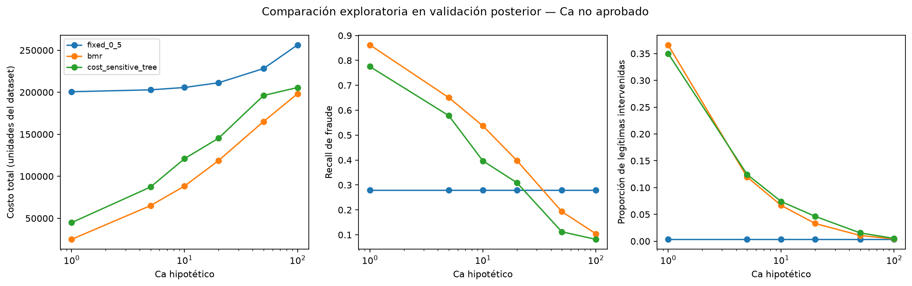

# Comparación económica exploratoria en validación posterior

## 1. Pregunta y alcance

Después de reajustar XGBoost y diagnosticar su calibración, nos preguntamos cómo cambian el costo, la detección de fraude y la intervención de legítimas cuando aplicamos tres políticas bajo una misma matriz. Una ventaja de AP no implica una ventaja económica, y un calibrador ajustado no garantiza una corrección útil en el periodo siguiente.

El experimento está en `notebooks/07_comparacion_economica_validation.ipynb`. Las funciones de comparación están en `src/fraud_cost/economics.py` y reutilizan `costs.py`, `features.py`, `refit.py` y los escenarios del 04. No entrenamos de nuevo XGBoost ni el calibrador. Los árboles de decisión sí requieren ajustes propios por Ca.

Esta etapa es retrospectiva y exploratoria en validation posterior. Ca toma valores ilustrativos de 1, 5, 10, 20, 50 y 100 unidades del dataset. No estimamos costos administrativos observados, no verificamos moneda y no seleccionamos Ca para maximizar el ahorro. Test permanece sin puntuar.

## 2. Población y controles de comparabilidad

La evaluación corresponde a las 42.047 operaciones posteriores de validation, con 1.517 fraudes y monto fraudulento total de 254.536,812 unidades. Recuperamos exactamente la población del 06: cotejamos IDs, tiempos, etiquetas y montos originales contra sus probabilidades guardadas. Los hashes de fuentes y artefactos se verifican antes de cargar el modelo local.

Train contiene 380.815 transacciones. Solo ese bloque ajusta los árboles. Las filas de test y gaps se descartan antes de preparar atributos; las filas tempranas de validation no ajustan árboles ni modifican el calibrador. Reconstruimos los atributos estrictamente anteriores de train y aplicamos el preprocesamiento ya ajustado del 06, sin volver a aprender medianas o categorías.

Las operaciones posteriores utilizan el estado histórico de train congelado. Comprobamos que la matriz reconstruida permita a XGBoost reproducir exactamente sus probabilidades originales guardadas. Las matrices tienen 2.642 columnas; convertimos la de entrenamiento a CSC una sola vez para los árboles, manteniendo float32.

Las tres políticas comparten población, monto, matriz y referencias de ahorro. La regla fija y BMR usan el mismo XGBoost calibrado; el árbol aprende una acción con atributos y costos de train. No lo presentamos como otra calibración del clasificador ni como una nueva etiqueta de fraude.

## 3. Matriz, acciones y árbol ponderado

Mantenemos la formulación del anteproyecto, desarrollada en `docs/03_protocolo_costos_y_evaluacion.md`: intervenir cuesta Ca en fraude y legítimas; aprobar fraude cuesta su monto; aprobar legítimas cuesta cero. Suponemos que intervenir evita la pérdida fraudulenta, sin modelar recuperación, eficacia imperfecta o capacidad de revisión.

La política fija interviene si `p_i >= 0,5`. BMR compara riesgos esperados y actúa si `p_i × A_i > Ca`, aprobando en empate. El corte clasificatorio 0,5 no se optimiza. Para el árbol, la acción óptima con etiqueta de entrenamiento conocida es `z_i = 1[y_i A_i > Ca]` y el peso es `|y_i A_i−Ca|`. Esto equivale a costo empírico como error ponderado más una constante por fila.

Por cada Ca ajustamos un CART con profundidad máxima 12, mínimo 250 operaciones por hoja y semilla 42, parámetros definidos antes de consultar esta comparación y conservados desde el protocolo anterior. Normalizamos pesos por su media, una constante común que no cambia sus proporciones. La impureza ponderada es una aproximación heurística: la equivalencia del objetivo no garantiza que CART encuentre el mínimo global de costo, ni convierte esta implementación en un árbol exacto de costos por ejemplo.

## 4. Qué medimos y qué significan las referencias

El costo realizado suma administración y monto de fraude aprobado. La referencia trivial es `min(suma de montos de fraude, N×Ca)`. Reportamos tanto ahorro frente a esa referencia como mejora frente a la política fija; no son intercambiables. Un ahorro negativo es un resultado posible, no un error de cálculo.

La referencia cambia dentro de la cuadrícula: intervenir todo resulta más barato en Ca=1 y Ca=5; para los demás escenarios aprobar todo es la alternativa trivial de menor costo. Esto ayuda a explicar cambios del porcentaje de ahorro que no proceden exclusivamente del modelo. Ca sigue siendo un supuesto externo, no un hiperparámetro.

Recall de fraude, recall ponderado por monto, cantidad de intervenciones y tasa de legítimas intervenidas explican los compromisos detrás del costo. El árbol predice acciones y estas métricas describen su relación con el fraude real, no exactitud de una etiqueta clasificatoria propia.

También calculamos costo esperado común con las probabilidades del XGBoost: Ca para una intervención y `p_i A_i` para una aprobación. BMR minimiza este riesgo por construcción, incluso frente a las acciones del árbol. Esa propiedad matemática no demuestra que su costo realizado sea menor. La diferencia entre costo esperado y realizado tampoco identifica por sí sola un error de calibración: incluye variabilidad de resultados y la importancia de los montos.

## 5. Resultados de la corrida

### 5.1. Costo realizado por escenario

| Ca ilustrativo | Costo fijo | Costo BMR | Costo árbol | Ahorro BMR vs. referencia trivial | Reducción BMR vs. fijo |
|---:|---:|---:|---:|---:|---:|
| 1 | 200.631,515 | 24.960,249 | 44.850,690 | 40,64% | 87,56% |
| 5 | 202.883,515 | 65.114,851 | 87.286,074 | 69,03% | 67,91% |
| 10 | 205.698,515 | 88.400,085 | 121.023,065 | 65,27% | 57,02% |
| 20 | 211.328,515 | 118.762,070 | 145.361,263 | 53,34% | 43,80% |
| 50 | 228.218,515 | 165.184,051 | 196.150,268 | 35,10% | 27,62% |
| 100 | 256.368,515 | 198.291,022 | 205.672,416 | 22,10% | 22,65% |

Los montos se presentan con tres decimales para conservar la escala original, sin asignar una moneda. BMR obtiene el menor costo realizado de las tres políticas en esta ventana y cuadrícula. El árbol reduce el costo frente al fijo en todos los escenarios, pero no supera BMR. No tratamos los seis escenarios como seis réplicas independientes: utilizan las mismas operaciones y etiquetas, y no calculamos aquí intervalos de incertidumbre o superioridad estadística.

El mayor ahorro BMR frente a la referencia trivial aparece en Ca=5. No lo elegimos como costo operativo óptimo: Ca es un supuesto exógeno y la referencia cambia con él. El resultado describe sensibilidad bajo la matriz, no una recomendación de precio de revisión.

### 5.2. Descomposición del caso Ca=10

| Política | Intervenciones | Fraudes intervenidos | Legítimas intervenidas | Costo administrativo | Fraude aprobado | Costo total |
|---|---:|---:|---:|---:|---:|---:|
| Fija 0,5 | 563 | 423 | 140 | 5.630,000 | 200.068,515 | 205.698,515 |
| BMR | 3.522 | 815 | 2.707 | 35.220,000 | 53.180,085 | 88.400,085 |
| Árbol ponderado | 3.603 | 602 | 3.001 | 36.030,000 | 84.993,065 | 121.023,065 |

BMR no es más barato porque revise menos que la política fija: interviene 2.959 operaciones adicionales. Su administración aumenta 29.590 unidades, pero el monto fraudulento aprobado disminuye 146.888,430. La diferencia neta es una reducción de 117.298,430, equivalente a 57,02% frente al fijo. El ahorro de 65,27% usa otra referencia: aprobar todo cuesta 254.536,812 y es más barato que intervenir todo, cuyo costo sería 420.470.

La política fija obtiene recall de fraude 27,88%, tasa de legítimas intervenidas 0,35% y recall ponderado por monto 21,40%. BMR pasa a 53,72%, 6,68% y 79,11%, respectivamente. El árbol obtiene 39,68%, 7,40% y 66,61%. Esta lectura distingue detectar más fraudes de cubrir una mayor fracción del monto fraudulento, y hace visible el aumento de revisión de legítimas.

El riesgo esperado común en Ca=10 es 83.903,343 para BMR, 106.851,549 para el árbol y 168.665,502 para el fijo. Los costos realizados son superiores a esos riesgos en esta corrida. No interpretamos la diferencia como una medida aislada de calibración; sí recordamos que optimizar el riesgo del modelo y observar pérdidas son operaciones distintas.

### 5.3. Compromisos y referencias que no debemos ocultar



Al elevar Ca, BMR reduce intervenciones y recall; los conjuntos de acción son anidados por su regla multiplicativa. En Ca=50 y Ca=100 su recall por número de fraudes queda por debajo del fijo, pero el costo sigue siendo menor. Maximizar recall no equivale a minimizar costo bajo montos variables.

Con Ca=1, el árbol cuesta 44.850,690 frente a 42.047 de intervenir todo: su ahorro respecto a la referencia trivial es negativo, aproximadamente −6,67%, aunque mejora mucho frente al fijo. El fijo también tiene ahorro negativo en Ca=1 y Ca=100. Por eso una reducción respecto al clasificador no basta para afirmar conveniencia frente a alternativas triviales.

Los seis árboles alcanzan la profundidad máxima 12, con hojas que disminuyen de 415 en Ca=1 a 128 en Ca=100. Esta configuración acotada no agota las posibilidades del método ni prueba que otro árbol no pueda mejorar. Los tiempos de ajuste y predicción van aproximadamente de 70 a 181 segundos por escenario en este equipo, sin incluir toda la carga y preparación; no son un benchmark universal.

## 6. Efecto de la calibración sobre BMR

En el 06 la calibración dejó AP igual y empeoró ligeramente Brier y log-loss posteriores. Aquí diagnosticamos por separado cuántas acciones BMR cambian al usar probabilidades originales o calibradas, y cómo se descompone la diferencia realizada:

```text
Δ costo = Δ costo administrativo + Δ monto de fraude aprobado
```

Un delta positivo significa mayor costo realizado con probabilidades calibradas para ese Ca. No usamos este diagnóstico para escoger retrospectivamente el calibrador ni lo presentamos como una cuarta estrategia principal. Un cambio pequeño de probabilidad puede cruzar `Ca/A_i`; su relevancia económica depende del monto y del estado real de esas operaciones, no solo del cambio global de Brier.

| Ca | Acciones BMR distintas | Intervenciones añadidas | Intervenciones retiradas | Costo BMR original | Costo BMR calibrado | Delta calibrado − original |
|---:|---:|---:|---:|---:|---:|---:|
| 1 | 1.094 | 0 | 1.094 | 25.225,644 | 24.960,249 | −265,395 |
| 5 | 441 | 0 | 441 | 65.684,903 | 65.114,851 | −570,052 |
| 10 | 242 | 0 | 242 | 88.354,988 | 88.400,085 | +45,097 |
| 20 | 128 | 1 | 127 | 118.750,707 | 118.762,070 | +11,363 |
| 50 | 47 | 1 | 46 | 165.571,685 | 165.184,051 | −387,634 |
| 100 | 10 | 0 | 10 | 197.962,022 | 198.291,022 | +329,000 |

La calibración reduce el costo BMR en tres escenarios y lo aumenta en otros tres. Esto ocurre aun cuando AP permaneció igual y Brier/log-loss empeoraron ligeramente: la calidad probabilística agregada y el costo de una política no son el mismo objetivo. Con Ca=10 retiramos 242 intervenciones, ahorrando 2.420 unidades administrativas; el monto fraudulento aprobado aumenta 2.465,097, de modo que el costo neto crece 45,097. El signo surge de ese balance, no de un juicio genérico sobre calibrar.

La probabilidad media disminuyó en el 06, pero el mapeo no reduce todos los riesgos individuales. Con Ca=20 y Ca=50 añade una intervención mientras retira otras. Conservar el orden de las probabilidades de fraude tampoco conserva necesariamente todas las decisiones económicas, pues estas dependen de su valor y del monto de cada operación.

Estos resultados no justifican escoger una versión de probabilidades diferente para cada Ca a partir de las mismas etiquetas posteriores. Conservamos la comparación principal calibrada y documentamos el diagnóstico; su interpretación mantiene las limitaciones de una evaluación retrospectiva y de una única ventana.

## 7. Evidencia y reproducción

Conservamos estas salidas:

| Archivo | Contenido | Versionado |
|---|---|---|
| `results/tables/comparacion_economica_validation.csv` | Tres estrategias, costos, componentes, referencias, riesgo esperado y métricas de acción | Sí |
| `results/tables/diagnostico_bmr_calibracion.csv` | Cambios de acción y costo BMR raw/calibrado | Sí |
| `results/tables/arboles_costos_diagnostico.csv` | Tamaño, profundidad, parámetros y tiempos de cada árbol | Sí |
| `results/tables/comparacion_economica_config.json` | Escenarios, fuentes, artefactos, versiones y estado Git | Sí |
| `results/figures/comparacion_economica_validation.png` | Compromisos entre costo, detección e intervención de legítimas | Sí |
| `results/models/cost_trees_hypothetical.joblib` | Un árbol por Ca ilustrativo | No |
| `data/interim/decisiones_economicas_validation.parquet` | Acciones por ID para auditar costos y diagnóstico | No |

Modelos y acciones permanecen locales e ignorados por Git; pueden regenerarse. Las acciones permiten recalcular cada costo sin volver a entrenar. Los modelos serializados solo deben cargarse desde fuentes confiables. No sobrescribimos la referencia del 03/04 ni el predictor del 06.

Las pruebas comprueban población y matriz comunes, mínimo esperado de BMR, equivalencia entre acciones y costos exportados, descomposición del efecto de calibración y exclusión de bloques externos. Cambiar etiquetas posteriores no cambia acciones ni árboles; las etiquetas se usan para medir los resultados, no para decidir. Verificamos además que reconstruir matrices no actualice el historial del predictor.

El hash del notebook considera solo tipos y fuentes de celdas de código, como en el 06; excluye Markdown, salidas y conteos. Módulos y artefactos se identifican por bytes. Los hashes de datos originales y manifiesto están en el registro del reajuste, enlazado y verificado por esta etapa. Cada registro describe su propia corrida: que el 06 indique ausencia de evaluación económica no significa que esta etapa posterior no la realice.

## 8. Decisiones pendientes antes de evaluar test

Necesitamos justificar con el equipo y la profesora el rango final de Ca y las unidades; discutir la fiabilidad probabilística en las regiones relevantes para BMR; y congelar predictor, calibrador, representación, reglas y árboles asociados a los escenarios finales. No activamos test por haber terminado una comparación hipotética.

Si el diagnóstico motiva ajustes nuevos, se registrarán como otros experimentos de desarrollo. Esta ventana ya ha sido usada en exploración: no ofrece confirmación independiente ni garantías de ahorro operativo. El test también conserva la limitación histórica de consulta agregada de etiquetas durante el EDA y la selección de gaps, documentada en el informe 02.
