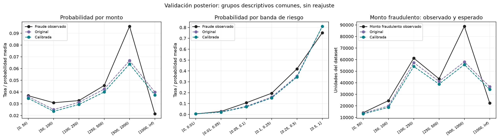
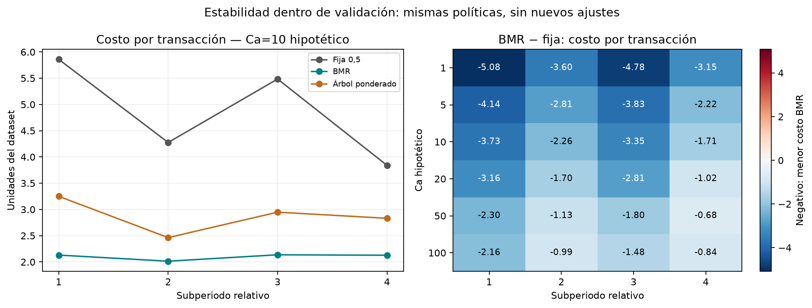

# 08. Diagnóstico probabilístico y estabilidad económica

## 1. Propósito y punto de partida

En la etapa 07 BMR obtuvo el menor costo realizado de las tres políticas para los seis Ca ilustrativos sobre la ventana posterior completa. Sin embargo, en el 06 la calibración conservó AP y empeoró ligeramente Brier y log-loss. No interpretamos el buen resultado económico como una validación automática de las probabilidades. Queremos entender en qué grupos se separan las predicciones de lo observado y si la ventaja agregada se conserva al descomponer el tiempo.

Esta etapa es descriptiva. Utilizamos únicamente las 42.047 operaciones posteriores de validación, con 1.517 fraudes (3,61%). Reutilizamos las probabilidades del 06 y las acciones del 07, verificando su procedencia y correspondencia por TransactionID. No entrenamos modelos, no actualizamos historiales, no seleccionamos otro calibrador y no puntuamos test.

Los escenarios Ca=1,5,10,20,50,100 siguen siendo hipotéticos en unidades del dataset, sin moneda verificada ni aprobación como costos operativos. La matriz permanece: intervenir cuesta Ca en ambas clases; aprobar fraude cuesta Aᵢ=TransactionAmt; aprobar legítimas cuesta cero. Suponemos que la intervención evita todo el monto fraudulento, sin modelar capacidad limitada, recuperación ni fallos de revisión.

## 2. Diseño del diagnóstico

### 2.1. Bandas fijas y poblaciones comparables

Antes de calcular los resultados fijamos seis bandas de monto: [0,50), [50,100), [100,250), [250,500), [500,1000), [1000,∞). Para la probabilidad calibrada fijamos [0,0,01), [0,01,0,05), [0,05,0,10), [0,10,0,25), [0,25,0,50), [0,50,1]. Todos los intervalos incluyen su límite inferior; el último de riesgo también incluye 1.

Son agrupaciones para describir resultados, no cortes aprendidos de las etiquetas ni umbrales de acción nuevos. Los grupos de riesgo usan la probabilidad calibrada; medimos también la original en esas mismas operaciones. Si cada versión generara sus propios grupos, cambiaría la población y la comparación sería menos directa. La elección de grupos por p calibrada no hace que esa versión sea superior: es la referencia de la comparación principal del 07.

Conservamos los grupos vacíos en la tabla, con cero operaciones y tasas no definidas, no tasas de fraude cero. El cruce monto × riesgo contiene 36 grupos; en esta corrida ninguno está vacío, pero 11 tienen menos de 100 operaciones. Ese conteo es una advertencia descriptiva, no un umbral que convierta los otros grupos en estimaciones estadísticamente garantizadas.

### 2.2. Qué contrastamos

Para cada grupo reportamos número de operaciones, fraudes, tasa observada, probabilidad media, Brier y monto. Definimos:

```text
Residuo de probabilidad = tasa de fraude observada − probabilidad media
Monto fraudulento esperado = Σ pᵢ Aᵢ
Monto fraudulento observado = Σ yᵢ Aᵢ
Residuo de monto = Σ (yᵢ − pᵢ) Aᵢ
```

Un residuo positivo indica subestimación en el grupo observado. No prueba que cada predicción individual sea incorrecta ni identifica la causa del error. La calibración agregada y la condicional son distintas: dos grupos pueden tener residuos opuestos que se compensan en el total.

Las sumas de monto incluyen todas las operaciones, independientemente de la acción. No son pérdidas BMR ni ahorro por intervención. El costo realizado de una política incluye Ca por intervención y únicamente el monto fraudulento **aprobado**. La diferencia entre estos conceptos evita atribuir a la política un residuo calculado sobre otra población.

Tampoco tratamos las operaciones como réplicas independientes. No calculamos intervalos de confianza ni pruebas de superioridad en esta etapa; hay posible dependencia temporal y por entidades, y seguimos examinando la misma ventana de desarrollo.

## 3. Calibración por monto y riesgo

### 3.1. El error no se distribuye uniformemente entre montos

| Monto | Operaciones | Fraudes | Tasa observada | Probabilidad calibrada media | Monto fraudulento observado | Esperado calibrado |
|---|---:|---:|---:|---:|---:|---:|
| [0,50) | 13.918 | 513 | 3,69% | 3,46% | 14.055,747 | 13.065,571 |
| [50,100) | 11.495 | 355 | 3,09% | 2,36% | 24.520,048 | 18.664,249 |
| [100,250) | 12.075 | 395 | 3,27% | 2,94% | 61.271,060 | 54.098,807 |
| [250,500) | 2.742 | 125 | 4,56% | 4,00% | 43.417,257 | 38.817,038 |
| [500,1000) | 1.209 | 116 | 9,59% | 6,38% | 88.800,310 | 55.668,023 |
| [1000,∞) | 608 | 13 | 2,14% | 3,74% | 22.472,390 | 34.203,458 |

El modelo calibrado subestima la frecuencia y el monto fraudulento en las primeras cinco bandas. La separación más importante por monto aparece en [500,1000): el residuo alcanza 33.132,287 unidades. Es una región relevante para la decisión económica, aunque contiene muchas menos operaciones que las bandas bajas.

En [1000,∞) el signo se invierte: el monto esperado supera al observado en 11.731,068. Solo hay 13 fraudes en 608 operaciones; no usamos esa cifra para construir una regla nueva ni asumimos que montos mayores siempre implican mayor prevalencia. El monto tiene un papel explícito en el costo de aprobar fraude, pero eso no exige una relación monótona entre monto y probabilidad de fraude.

En toda la ventana, ΣpᵢAᵢ es 226.690,690 con probabilidades originales y 214.517,146 con las calibradas, frente a 254.536,812 observado. El residuo pasa de 27.846,122 a 40.019,666 unidades. El procedimiento de calibración no corrige esta subestimación global ponderada por monto en la ventana posterior. No sustituimos por ello el calibrador retrospectivamente: este hallazgo forma parte de la evidencia que debemos discutir antes de congelar la evaluación final.

### 3.2. El orden de riesgo se conserva, pero su escala tiene desajustes

| Banda de p calibrada | Operaciones | Fraudes | Tasa observada | p media |
|---|---:|---:|---:|---:|
| [0,0,01) | 23.604 | 105 | 0,44% | 0,51% |
| [0,01,0,05) | 14.381 | 388 | 2,70% | 2,04% |
| [0,05,0,10) | 1.897 | 203 | 10,70% | 6,91% |
| [0,10,0,25) | 1.218 | 237 | 19,46% | 15,14% |
| [0,25,0,50) | 384 | 161 | 41,93% | 34,38% |
| [0,50,1] | 563 | 423 | 75,13% | 81,08% |

La frecuencia observada aumenta entre estas bandas, pero la predicción media subestima el fraude en las cuatro intermedias y lo sobreestima en los extremos. Esto ayuda a comprender por qué conservar AP —una medida de ordenamiento— no garantiza que la escala probabilística sea adecuada para BMR.

En la banda p≥0,5 se sobreestima la **frecuencia**, pero el monto esperado calibrado (51.481,644) es inferior al observado (54.468,297). No es una contradicción: ponderar por Aᵢ cambia la contribución de cada operación. Una coincidencia o exceso en la tasa promedio no garantiza coincidencia en ΣpᵢAᵢ.

### 3.3. El cruce monto × riesgo localiza señales que el promedio oculta

En [500,1000) y p∈[0,05,0,10) hay 113 operaciones y 26 fraudes: la tasa observada es 23,01%, frente a p media de 6,92%. Su residuo de monto es +11.911,607. En la misma banda de monto y p∈[0,25,0,50), 29 de 54 operaciones son fraude y el residuo de monto es +11.378,798. El segundo grupo es pequeño; reportamos sus conteos precisamente para no presentar la brecha como una estimación robusta o confirmada.

Mostramos en el notebook los seis mayores residuos absolutos de monto para inspección, pero exportamos los 36 cruces completos, tanto raw como calibrados. Esa selección de presentación no selecciona un modelo, un calibrador o una regla de acción. Las señales no autorizan una corrección por bandas usando estas mismas etiquetas y luego una afirmación de validación independiente.



## 4. Proximidad a la frontera de BMR

Definimos qᵢ=pᵢAᵢ/Ca, con Ca>0. BMR aprueba si qᵢ≤1 e interviene si qᵢ>1. No necesitamos calcular Ca/Aᵢ, lo que evita dividir por montos cero. Cuando Aᵢ≤Ca, ninguna p válida produce una intervención estrictamente más conveniente bajo esta matriz.

Fijamos [0,0,5), [0,5,0,9), [0,9,1,1), [1,1,2) y [2,∞). La banda [0,9,1,1) representa cercanía descriptiva a la frontera, no un intervalo probabilístico ni una garantía de que solo allí puedan cambiar las acciones. Las bandas se definen con la probabilidad calibrada y después contrastamos las acciones raw/calibradas.

| Ca | Operaciones cercanas | Fraudes | Fracción de la ventana | Acciones distintas en la banda | Delta de costo calibrado − raw |
|---:|---:|---:|---:|---:|---:|
| 1 | 1.803 | 28 | 4,29% | 953 | −303,895 |
| 5 | 858 | 30 | 2,04% | 416 | −445,052 |
| 10 | 559 | 52 | 1,33% | 237 | +95,097 |
| 20 | 339 | 52 | 0,81% | 123 | +111,363 |
| 50 | 177 | 59 | 0,42% | 47 | −387,634 |
| 100 | 89 | 41 | 0,21% | 10 | +329,000 |

Los deltas de esta tabla corresponden **solo a la banda cercana**, no necesariamente al escenario completo del 07. Una fila cercana tampoco implica acción modificada: por ejemplo, en Ca=10 hay 559 filas cercanas y 237 cambios.

En Ca=10, la cercanía concentra 237 de los 242 cambios globales. Esas 237 intervenciones retiradas reducen la administración en 2.370 unidades, pero aumentan el fraude aprobado en 2.465,097: delta +95,097. Las otras cinco retiradas están en [0,5,0,9), son legítimas y ahorran 50,000. La suma +45,097 reproduce exactamente el diagnóstico global del 07. Hay además tres operaciones cercanas con Aᵢ≤Ca, para las cuales no es posible una intervención estrictamente óptima.

La proximidad permite localizar el efecto de la calibración. No indica por sí sola qué corrección sería adecuada: retirar una intervención puede ahorrar administración o dejar pasar un monto fraudulento superior. Mantener, añadir o retirar acciones debe interpretarse con la matriz completa, no únicamente con el cambio de p.

## 5. Estabilidad en subperiodos temporales

### 5.1. Qué cambia en la población

La ventana posterior tiene TransactionDT de 11.293.020 a 12.666.174, una diferencia de aproximadamente 15,893 días. La dividimos en cuatro intervalos de igual duración relativa, de aproximadamente 3,973 días. No son semanas calendario ni muestras de igual tamaño; las operaciones con el mismo tiempo se asignan juntas.

| Subperiodo | Operaciones | Fraudes | Tasa observada | p calibrada media | Monto fraudulento observado | Esperado calibrado |
|---|---:|---:|---:|---:|---:|---:|
| 1 | 10.888 | 447 | 4,11% | 3,45% | 75.779,332 | 59.297,569 |
| 2 | 10.419 | 335 | 3,22% | 2,77% | 61.583,477 | 51.034,625 |
| 3 | 10.783 | 402 | 3,73% | 3,25% | 70.206,314 | 58.281,757 |
| 4 | 9.957 | 333 | 3,34% | 3,04% | 46.967,689 | 45.903,195 |

La probabilidad media calibrada y el monto esperado están por debajo de lo observado en los cuatro periodos, pero el residuo de monto es mucho menor en el último: +1.064,494, frente a +16.481,763 en el primero. No atribuimos esta diferencia automáticamente a drift o a una causa particular; la composición por monto, entidades y riesgo también puede cambiar. Este diagnóstico no compara atributos completos ni identifica mecanismos causales.

### 5.2. Ca=10: ventaja sostenida frente al fijo, no ahorro uniforme

| Subperiodo | Costo fijo | Costo BMR | Costo árbol | Costo BMR por operación |
|---|---:|---:|---:|---:|
| 1 | 63.784,291 | 23.195,006 | 35.382,636 | 2,130 |
| 2 | 44.546,625 | 20.985,287 | 25.664,054 | 2,014 |
| 3 | 59.137,045 | 23.034,227 | 31.787,224 | 2,136 |
| 4 | 38.230,554 | 21.185,565 | 28.189,151 | 2,128 |

BMR obtiene menor costo realizado que las otras dos políticas en los cuatro periodos de este escenario. Su costo por operación varía poco aquí, mientras el fijo tiene una variación mayor. Es una descripción de esta ventana y este Ca, no una propiedad general del método. El ahorro relativo BMR frente a la referencia trivial local pasa de 69,39% en el primero a 54,89% en el cuarto: una ventaja sostenida no implica una magnitud uniforme.

Los costos BMR desagregados suman 88.400,085, reproduciendo el total del 07. También verificamos los componentes administrativos, fraude aprobado, conteos de acción y riesgo esperado de las tres estrategias en todos los Ca.

### 5.3. Una excepción que no aparece en el agregado

BMR cuesta menos que el fijo en las 24 combinaciones de seis Ca y cuatro periodos. Frente a las tres políticas, obtiene el menor costo realizado en 23 combinaciones. La excepción es Ca=100 en el cuarto periodo:

| Política | Costo realizado | Riesgo esperado con p calibrada común |
|---|---:|---:|
| Fija 0,5 | 49.840,554 | 48.779,076 |
| BMR | 41.467,007 | 37.551,596 |
| Árbol ponderado | 39.775,411 | 41.718,727 |

El árbol cuesta 1.691,596 menos que BMR en ese segmento, aunque BMR mantiene el mínimo esperado bajo las probabilidades del XGBoost. La diferencia hace explícito que optimizar riesgo estimado no garantiza obtener el menor costo realizado en cada segmento. No escogemos ahora el árbol solo para el cuarto periodo: sería una política nueva, decidida retrospectivamente con sus etiquetas.

Las 24 combinaciones no son 24 experimentos independientes. Comparten operaciones, políticas y escenarios anidados; no utilizamos el conteo de victorias como prueba estadística ni como garantía de generalización. El resultado agregado favorable del 07 permanece correcto, pero su descomposición exige una conclusión más precisa.



## 6. Referencias, agregación y límites de interpretación

Los costos totales y sus componentes son aditivos porque cada operación se asigna a un único periodo. Las tasas requieren denominadores y los porcentajes de ahorro no se suman ni se promedian sin definir correctamente la ponderación.

En cada periodo recalculamos min(costo de aprobar todo, costo de intervenir todo). La suma de esos mínimos puede ser menor que la referencia global: permitir una referencia distinta por periodo no es la misma política trivial que escoger una para toda la ventana. Para el total mantenemos los valores del 07; no sustituimos su referencia por una suma de mínimos locales.

Los diagnósticos localizan discrepancias, pero no prueban que recalibrar por monto, incorporar atributos o cambiar un árbol vaya a solucionarlas. Si decidimos otro experimento, debemos documentar que surgió de esta exploración. No sería correcto ajustarlo con estas etiquetas y presentarlo luego como una mejora confirmada en validación independiente.

## 7. Artefactos, verificación y reproducción

El notebook `08_diagnostico_y_estabilidad.ipynb` tiene cinco celdas de código que recorren el diagnóstico; la agrupación, validación y exportación reutilizables están en `src/fraud_cost/diagnostics.py`. No duplicamos la matriz ni las métricas económicas del módulo `costs.py`.

| Archivo | Contenido |
|---|---|
| `results/tables/diagnostico_calibracion_condicional.csv` | 96 filas: monto, riesgo y 36 cruces, para probabilidades originales/calibradas |
| `results/tables/diagnostico_frontera_bmr.csv` | 30 filas: cinco bandas de q por cada Ca, cambios de acción y costos |
| `results/tables/diagnostico_subperiodos_validation.csv` | Ocho filas: cuatro poblaciones temporales para cada versión de probabilidad |
| `results/tables/diagnostico_costos_subperiodos.csv` | 72 filas: cuatro periodos × seis Ca × tres estrategias |
| `results/tables/diagnostico_estabilidad_config.json` | Cortes, reglas, unidades, hashes, versiones, intérprete y estado Git de la corrida |
| `results/figures/diagnostico_probabilistico_validation.png` | Tasas y montos observados/esperados por bandas |
| `results/figures/estabilidad_economica_validation.png` | Costo por operación para Ca=10 y diferencias BMR/fijo para todos los Ca |

Todas estas salidas son agregadas y se pueden versionar. No creamos modelos ni nuevos archivos por transacción. Para regenerar necesitamos los scores y las acciones locales del 06/07; si faltan, se reconstruyen ejecutando las etapas previas, no descargando serializaciones desconocidas.

Ejecutamos el notebook completo con el kernel del proyecto y comprobamos los hashes, las salidas y los totales contra el 07. Las 47 pruebas del repositorio pasan, incluidas diez nuevas sobre fronteras de bandas, grupos vacíos, probabilidades originales/calibradas en poblaciones comunes, etiquetas que no cambian agrupaciones ni acciones, costos aditivos, tiempos simultáneos y rechazo de entradas modificadas o desalineadas. Las figuras se revisaron visualmente.

## 8. Qué debemos cerrar ahora

Tenemos evidencia de una ventaja económica exploratoria de BMR frente al fijo, acompañada de desajustes probabilísticos y una excepción frente al árbol en un segmento. El siguiente paso es discutir el cierre metodológico, no puntuar automáticamente test:

1. Justificar con el equipo y la profesora el rango final de Ca y sus unidades. Sin costos observados, los escenarios finales deben conservar su condición hipotética.
2. Resolver y documentar si mantenemos el procedimiento de calibración actual con sus limitaciones o abrimos otro experimento de desarrollo. No elegir una versión por cada Ca usando el costo posterior.
3. Congelar el predictor, calibrador, representación, reglas, escenarios y árboles correspondientes antes de la evaluación final.

La validación posterior ha sido reutilizada en varios análisis; no es confirmación independiente. El bloque denominado test tampoco es un holdout estrictamente ciego: el EDA y la comparación histórica de gaps consultaron etiquetas agregadas, como registra el informe 02. Esa limitación debe permanecer en el informe final y la sustentación, aunque el modelado todavía no haya puntuado ese bloque.
