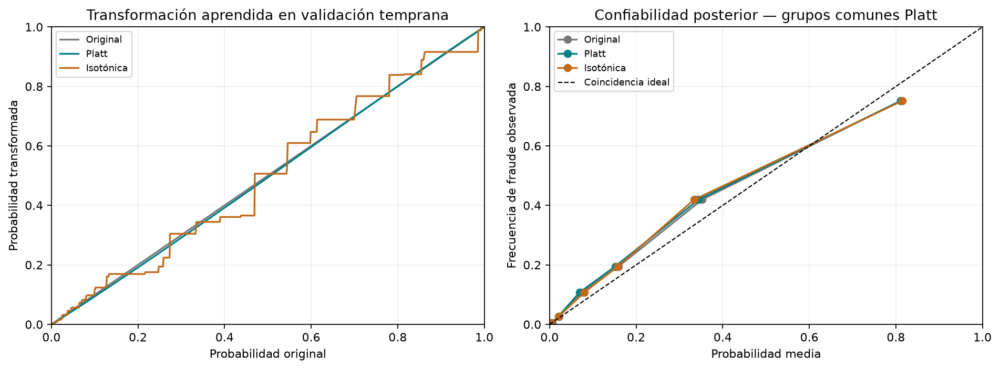
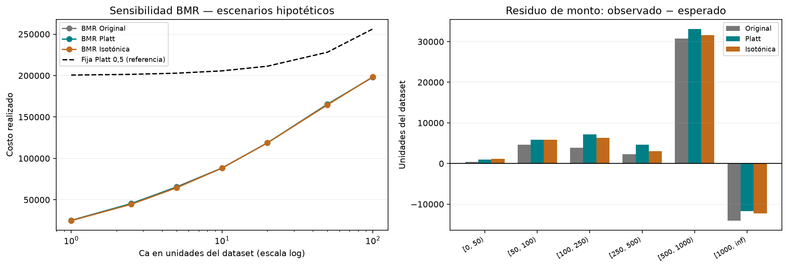

# 09. Comparación de calibradores y fundamento de los escenarios de costo

## 1. Por qué realizamos este experimento

En el 06 Platt conservó AP, pero empeoró ligeramente Brier y log-loss frente a las probabilidades originales. En el 08 observamos desajustes por monto y periodo. Estos hallazgos motivan un experimento acotado: mantener el mismo XGBoost y contrastar su escala probabilística original, Platt e isotónica. No buscamos otro clasificador ni seleccionamos el calibrador que más ahorro produzca para cada Ca.

La propuesta entregada contempla ambas alternativas. En la sección 9, «Modelado y calibración», página 3, se establece: «se aplica una calibración posterior por regresión isotónica o de Platt». Compararlas es compatible con lo propuesto, aunque el documento no obliga a ejecutar las dos. Este experimento continúa el desarrollo; no reemplaza retrospectivamente los resultados del 06/07.

Nuestro objetivo es separar tres preguntas: ¿las probabilidades representan mejor la frecuencia observada?, ¿se conserva el ordenamiento de riesgo?, y ¿cómo cambian las acciones y sus costos? Una respuesta favorable en una dimensión no resuelve automáticamente las otras.

## 2. Qué aporta la literatura a Ca

Ca representa el costo administrativo de intervenir una operación. En nuestra matriz se paga tanto por fraude intervenido como por operación legítima intervenida. El dataset no aporta una medición de ese costo operativo.

| Fuente primaria | Valores originales | Contexto y alcance |
|---|---|---|
| Bahnsen et al. (2013), sección V.E y tabla VI | 1; 2,5; 5 euros, con 2,5 como escenario base | Sensibilidad del costo de revisión sobre datos de un procesador europeo; no son costos medidos de IEEE-CIS |
| Bahnsen et al. (2014), sección 4 | 10 euros | Estimación realizada con el equipo interno de riesgo de la empresa de ese estudio; no es un costo universal |

Los valores y contextos anteriores proceden de [Cost Sensitive Credit Card Fraud Detection using Bayes Minimum Risk](https://albahnsen.github.io/files/Cost%20Sensitive%20Credit%20Card%20Fraud%20Detection%20using%20Bayes%20Minimum%20Risk%20-%20Publish.pdf) y [Improving Credit Card Fraud Detection with Calibrated Probabilities](https://albahnsen.github.io/files/%20Improving%20Credit%20Card%20Fraud%20Detection%20by%20using%20Calibrated%20Probabilities%20-%20Publish.pdf). El segundo artículo utiliza otros procedimientos de calibración; no lo presentamos como una reproducción de nuestra comparación Platt/isotónica.

Para este diagnóstico fijamos Ca=1; 2,5; 5; 10 como escenarios numéricos inspirados en esos antecedentes, y Ca=20; 50; 100 como sensibilidad ampliada. Todos siguen siendo hipotéticos en unidades del dataset. Tomar sus números no equivale a trasladar euros, estimar dólares, actualizar precios históricos ni demostrar equivalencia operativa entre empresas. Ca y TransactionAmt deben tener unidades compatibles para interpretar un costo monetario; mientras no verifiquemos la moneda, reportamos una comparación bajo supuestos, no pérdidas financieras reales.

El valor 2,5 se incorpora únicamente al diagnóstico del 09. No cambia la rejilla histórica de seis escenarios del 07/08 ni implica que hayamos entrenado un árbol para ese nuevo valor. Tampoco elegimos Ca por el ahorro observado: es un supuesto externo que debe acordarse antes de la evaluación final.

## 3. Diseño y controles del experimento

### 3.1. Qué se ajusta y con qué datos

Reutilizamos el predictor del 06: XGBoost ajustado con 380.815 operaciones de train y Platt ajustado con 42.046 operaciones de validación temprana, de las cuales 1.558 son fraude. Verificamos hashes, particiones y correspondencia por TransactionID. Las probabilidades raw y Platt sobre las 42.047 operaciones posteriores coinciden con las guardadas en el 06.

Solo ajustamos isotónica, usando las probabilidades **originales** de XGBoost y las etiquetas de la misma validación temprana. No usamos las etiquetas posteriores para ajustar su transformación. No reajustamos XGBoost ni Platt, no remuestreamos, no ponderamos clases y no actualizamos el historial con validación. La comparación posterior contiene los mismos 1.517 fraudes y las mismas operaciones para las tres versiones.

La validación temprana abarca TransactionDT=10.126.067 a 11.293.017 y la posterior 11.293.020 a 12.666.174. La separación de tres segundos corresponde a la frontera entre operaciones, no a un nuevo gap experimental. Train conserva el gap de siete días respecto a validación; las dos mitades de validación no tienen un gap adicional y no separan operaciones simultáneas.

### 3.2. Diferencias entre las transformaciones

Platt utiliza una función sigmoide parametrizada sobre el logit de la probabilidad original, con el recorte numérico definido en el 06. En esta corrida es estrictamente creciente: conserva el orden de las puntuaciones y, por tanto, AP.

Isotónica aprende una transformación no decreciente más flexible, con mesetas que asignan una misma probabilidad a distintas puntuaciones. Nuestro estimador interpola entre puntos de la función ajustada y recorta al extremo correspondiente cuando la entrada queda fuera del rango aprendido. Puede crear empates y modificar AP sin invertir el orden de riesgo. La flexibilidad también puede producir probabilidades extremas. Estas propiedades se describen en la [documentación de calibración de scikit-learn](https://scikit-learn.org/stable/modules/calibration.html).

Fijamos log-loss global como lectura principal de esta comparación antes de generar los resultados; Brier, grupos, AP y consecuencias económicas son complementos. Esto organiza la lectura de este experimento de desarrollo, no constituye un preregistro del proyecto ni una regla automática de selección. Brier y log-loss evalúan calidad probabilística y no aíslan por sí solos la calibración de todas las demás propiedades predictivas.

Reutilizamos las bandas de monto, las bandas de riesgo **definidas con Platt** y los cuatro subperiodos del 08. Así, cada comparación por grupo utiliza exactamente las mismas operaciones. Exportamos 51 filas: total, seis bandas de monto, seis de riesgo y cuatro periodos, para tres versiones. Los grupos vacíos mantienen tasas no definidas; no se interpretan como ausencia de fraude.

### 3.3. Qué significa aquí evaluar

La ventana posterior ya se utilizó para diagnóstico y comparación económica. El experimento surge de esos resultados: no es una confirmación independiente ni permite inferir superioridad estadística. No reportamos intervalos de confianza ni tratamos grupos o escenarios como réplicas independientes.

El bloque temporal llamado test no se puntúa. Conservamos además la limitación documentada en el 02: el EDA inicial y la comparación histórica de gaps consultaron información agregada del candidato a test. No lo describiremos como un holdout estrictamente intocado.

## 4. Resultados probabilísticos

### 4.1. La mejora frente a Platt es pequeña y depende de la métrica

| Versión | AP | Brier | Log-loss | Probabilidad media |
|---|---:|---:|---:|---:|
| Original, sin calibrador | 0,46479424 | 0,02494245 | 0,10079061 | 3,3019% |
| Platt | 0,46479424 | 0,02500318 | 0,10115569 | 3,1323% |
| Isotónica | 0,44726786 | 0,02491620 | 0,10088664 | 3,1489% |

Menor Brier y log-loss es mejor; mayor AP es mejor. Isotónica obtiene el menor Brier y mejora log-loss respecto a Platt aproximadamente 0,266% en términos relativos. Sin embargo, la probabilidad original conserva el menor log-loss. Por ello no afirmamos que agregar un calibrador mejora necesariamente este predictor en esta ventana.

AP baja aproximadamente 1,75 puntos porcentuales con isotónica. Encontramos 82 probabilidades distintas, frente a 41.920 con raw/Platt. Hay 42.010 operaciones en grupos de probabilidades empatadas con isotónica, frente a 254 con las otras versiones. La reducción de AP es compatible con esas mesetas; no exige una inversión del ordenamiento. El número de probabilidades distintas es descriptivo, no un criterio de descarte por sí solo.

La tasa observada es 3,6079%. Las tres probabilidades medias quedan por debajo. Isotónica no elimina la subestimación agregada. Con el corte clasificatorio **sin modificar, de 0,5**, Platt produce 423 TP, 140 FP y 1.094 FN; isotónica, 449 TP, 148 FP y 1.068 FN. Cambia la escala de las probabilidades, no el valor del corte.

### 4.2. Probabilidades extremas: un hallazgo que debemos conservar

Isotónica asigna p=0 a 819 operaciones y p=1 a una. Entre las operaciones con p=0 aparece un fraude, con TransactionDT=12.052.318 y monto 30,95, en el tercer subperiodo. Las versiones raw y Platt le asignaban probabilidades pequeñas, pero positivas. No hay legítimas con p isotónica igual a 1 en esta ventana.

Una predicción cero ante un evento ocurrido recibe una penalización muy alta en log-loss. Para evaluar numéricamente usamos probabilidades float64; scikit-learn aplica internamente el epsilon de máquina, por lo que la penalización de esa operación es aproximadamente 36,04 y la métrica permanece finita. El valor exportado de la predicción sigue siendo cero: no lo corregimos después de observar la etiqueta ni introducimos un suavizado para mejorar el resultado.

El ajuste tiene 92 puntos de apoyo. Una operación posterior queda por debajo del mínimo raw observado al calibrar y ninguna supera el máximo. Recortar fuera del rango aprendido evita extrapolaciones de la función, pero no garantiza probabilidades adecuadas para datos futuros.

### 4.3. El monto conserva desajustes relevantes

Sobre toda la ventana, el monto fraudulento observado es 254.536,812 unidades. Comparamos ese valor con ΣpᵢAᵢ, sin aplicar acciones:

| Versión | Monto fraudulento esperado | Observado − esperado |
|---|---:|---:|
| Original | 226.690,690 | +27.846,122 |
| Platt | 214.517,146 | +40.019,666 |
| Isotónica | 218.900,859 | +35.635,953 |

Isotónica reduce el residuo de Platt en 4.383,713 unidades, pero no alcanza el menor residuo agregado de raw. Estos montos no son pérdidas realizadas de BMR: incluyen todas las operaciones, independientemente de la decisión.

La banda [500,1000) sigue siendo crítica: tiene 1.209 operaciones, 116 fraudes y tasa observada de 9,59%. Su probabilidad isotónica media es 6,58%, frente a 6,38% de Platt; el residuo de monto todavía alcanza +31.554,282 unidades. En [1000,∞), con solo 13 fraudes, isotónica sobreestima el monto en 12.249,624. No convertimos estos residuos en correcciones aprendidas sobre las etiquetas posteriores.

La mejora tampoco es uniforme: isotónica empeora log-loss frente a Platt en [0,50) y Brier en [250,500). Mantener estos resultados evita que el promedio oculte regiones desfavorables.

### 4.4. Estabilidad temporal descriptiva

| Subperiodo | Operaciones | Fraudes | Log-loss raw | Log-loss Platt | Log-loss isotónica |
|---|---:|---:|---:|---:|---:|
| 1 | 10.888 | 447 | 0,109931 | 0,110474 | 0,108473 |
| 2 | 10.419 | 335 | 0,091470 | 0,091685 | 0,091507 |
| 3 | 10.783 | 402 | 0,105554 | 0,105959 | 0,107334 |
| 4 | 9.957 | 333 | 0,095390 | 0,095675 | 0,095424 |

Isotónica mejora log-loss de Platt en tres subperiodos, pero lo empeora en el tercero, donde aparece el fraude con p=0. Brier también empeora frente a Platt en el segundo. No hablamos de cuatro validaciones independientes ni ajustamos un calibrador por periodo.



## 5. Consecuencias sobre BMR

Conservamos exactamente la matriz y la regla del proyecto:

```text
Riesgo esperado de intervenir = Ca
Riesgo esperado de aprobar = pᵢ Aᵢ
Intervenir si pᵢ Aᵢ > Ca; aprobar en el empate.
Costo realizado = Ca × número de intervenciones + Σ monto de fraudes aprobados.
```

Suponemos que intervenir evita toda la pérdida por fraude; no modelamos capacidad de revisión, recuperación ni intervención imperfecta. Comparamos BMR alimentado con cada versión y conservamos la política fija **Platt del 06** como referencia común. No cambiamos de referencia para favorecer un calibrador ni añadimos una cuarta política principal al proyecto.

| Ca hipotético | Costo BMR raw | Costo BMR Platt | Costo BMR isotónica | Delta isotónica − Platt |
|---:|---:|---:|---:|---:|
| 1 | 25.225,644 | 24.960,249 | 24.790,922 | −169,327 |
| 2,5 | 45.376,757 | 45.491,136 | 44.523,252 | −967,884 |
| 5 | 65.684,903 | 65.114,851 | 64.483,044 | −631,807 |
| 10 | 88.354,988 | 88.400,085 | 88.243,252 | −156,833 |
| 20 | 118.750,707 | 118.762,070 | 118.702,744 | −59,326 |
| 50 | 165.571,685 | 165.184,051 | 164.611,371 | −572,680 |
| 100 | 197.962,022 | 198.291,022 | 198.436,228 | +145,206 |

Isotónica reduce el costo de Platt en seis de siete escenarios, pero no en Ca=100. Son escenarios aplicados a las mismas operaciones, no siete ensayos independientes. Tampoco constituye una regla para elegir distintos calibradores según Ca.

En Ca=10 cambian 444 acciones: se añaden 298 intervenciones y se retiran 146. El aumento neto de 152 intervenciones cuesta 1.520 unidades adicionales; el monto fraudulento aprobado disminuye 1.676,833. La diferencia neta es −156,833, aproximadamente una mejora del 0,177% respecto a BMR Platt. Es un efecto pequeño: no lo confundimos con la mejora mucho mayor de BMR frente a la política fija.

En Ca=100 hay 20 intervenciones adicionales netas, que cuestan 2.000, mientras el monto de fraude aprobado disminuye 1.854,794. El balance empeora 145,206. Este caso muestra por qué detectar más fraude no siempre reduce el costo y por qué la calibración no puede defenderse solo con recall.



## 6. Archivos, reproducibilidad y verificación

El notebook contiene cinco celdas de código. La implementación compartida está en `src/fraud_cost/calibration.py`; reutiliza carga, métricas, grupos y costos existentes, sin introducir una segunda matriz. El informe interpreta las salidas, no sustituye su cálculo.

| Archivo en results/ | Contenido |
|---|---|
| `tables/calibradores_metricas_validation.csv` | Tres versiones, métricas globales, empates y probabilidades extremas |
| `tables/calibradores_grupos_validation.csv` | 51 filas de diagnóstico global, por monto, riesgo y periodo |
| `tables/calibradores_bmr_sensibilidad.csv` | 28 filas: siete Ca × cuatro entradas diagnósticas, incluida la referencia fija |
| `tables/calibradores_cambios_bmr.csv` | Siete filas con acciones añadidas/retiradas y descomposición del delta |
| `tables/comparacion_calibradores_config.json` | Protocolo, rejilla, versiones, hashes y estados de aprobación |
| `figures/comparacion_calibradores_validation.png` | Transformación y grupos de riesgo compartidos |
| `figures/calibradores_bmr_y_montos.png` | Costos y residuos por monto |

El calibrador candidato se guarda localmente en `results/models/candidate_isotonic_calibrator.joblib`, ignorado por Git, vinculado al hash del predictor del 06. Recibe probabilidades raw y utiliza `predict`; no debe insertarse directamente en la interfaz Platt, que transforma a logit y utiliza `predict_proba`. No sobrescribimos el predictor del 06 ni exportamos otro Parquet por operación.

Las 57 pruebas automatizadas pasan. Entre los controles nuevos verificamos que cambiar etiquetas posteriores no modifica el calibrador ni sus probabilidades/acciones, que no se permite test o solapamiento temporal, que la matriz conserva sus costos y que las versiones comparan la misma población. Recalculamos las cuatro tablas desde el calibrador candidato y los scores del 06; raw/Platt conservan las métricas del 06 y los costos comunes del 07. El notebook ejecutado no contiene errores; ambas figuras se revisaron visualmente.

## 7. Qué podemos concluir y qué queda pendiente

El experimento aporta evidencia para discutir isotónica, pero no una victoria uniforme: mejora ligeramente Brier y log-loss frente a Platt, reduce AP, mantiene desajustes por monto y genera una probabilidad cero para un fraude posterior. La probabilidad original obtiene menor log-loss global. La decisión debe considerar estas dimensiones y las limitaciones de reutilizar la misma ventana de desarrollo, no solo contar escenarios favorables.

Conservamos isotónica como **candidata, no aprobada**. El registro mantiene `selected_calibrator=null`, `calibrator_approved=false`, `costs_approved=false` y `test_evaluated=false`. Platt continúa siendo la referencia histórica de la comparación del 07, no una alternativa validada automáticamente por permanencia.

Antes de evaluar el bloque final debemos acordar el calibrador principal y los Ca que se reportarán, explicitar sus unidades/supuestos y congelar el protocolo de las tres políticas. Si cambiamos de calibrador, la comparación principal deberá actualizarse de forma coherente y trazable sobre desarrollo; no bastará con sustituir un archivo. La evaluación posterior deberá presentar costo total, ahorro y métricas explicativas, incluyendo los escenarios desfavorables.

## Referencias

- Propuesta del Proyecto Integrador II entregada, sección 9, página 3: alternativas de calibración; página 4: sensibilidad al costo administrativo.
- Bahnsen, A. C., Stojanovic, A., Aouada, D. y Ottersten, B. (2013). *Cost Sensitive Credit Card Fraud Detection using Bayes Minimum Risk*. DOI: [10.1109/ICMLA.2013.68](https://doi.org/10.1109/ICMLA.2013.68).
- Bahnsen, A. C., Aouada, D. y Ottersten, B. (2014). *Improving Credit Card Fraud Detection with Calibrated Probabilities*. DOI: [10.1137/1.9781611973440.78](https://doi.org/10.1137/1.9781611973440.78).
- scikit-learn. [Probability calibration](https://scikit-learn.org/stable/modules/calibration.html). Documentación consultada para interpretar sigmoid/isotonic; las versiones efectivamente ejecutadas están en el registro del experimento.
